# Tiny Second-hand Shopping Platform 개발 보고서

# 1. 프로젝트 개요

## 1.1 프로젝트명

Tiny Second-hand Shopping Platform

## 1.2 프로젝트 목적

본 프로젝트는 Flask와 SQLite를 이용하여 보안을 고려한 소규모 중고거래 플랫폼을 구현하는 것을 목표로 한다.

사용자는 회원가입 및 로그인 후 중고 상품을 등록하고 조회할 수 있으며, 다른 사용자와 1대1 메시지를 주고받을 수 있다. 또한 부적절한 사용자나 상품을 신고하고, 플랫폼 내부의 가상 포인트를 다른 사용자에게 송금할 수 있다.

관리자는 별도의 권한을 통해 사용자 정지, 상품 차단, 신고 처리 등의 관리 기능을 수행할 수 있다.

기능 구현 과정에서는 단순히 서비스가 작동하도록 만드는 데 그치지 않고, 다음과 같은 기본적인 보안 요구사항을 함께 고려하였다.

- 비밀번호 해시 저장
- 서버 측 입력값 검증
- 세션 기반 사용자 인증
- 사용자 및 관리자 권한 검증
- SQL Injection 방지
- 저장형 XSS 방지
- 메시지 발신자 위조 방지
- 포인트 송금 데이터 무결성 유지
- 민감한 데이터베이스 파일의 공개 저장소 업로드 방지

## 1.3 주요 구현 기능

본 프로젝트에서 구현한 주요 기능은 다음과 같다.

### 사용자 기능

- 회원가입
- 로그인 및 로그아웃
- 마이페이지 조회
- 소개글 수정
- 상품 등록
- 상품 목록 및 상세 조회
- 상품 수정 및 삭제
- 상품 검색
- 사용자 간 1대1 메시지
- 사용자 신고
- 상품 신고
- 가상 포인트 송금
- 송금 내역 조회

### 관리자 기능

- 전체 사용자 조회
- 사용자 계정 정지 및 해제
- 전체 상품 조회
- 상품 차단 및 해제
- 신고 목록 조회
- 신고 처리 완료

## 1.4 프로젝트 수행 범위

본 프로젝트는 로컬 개발환경에서 실행되는 교육용 웹 애플리케이션으로 구현하였다.

실제 결제나 현금 거래 기능은 포함하지 않았으며, 포인트 송금 기능은 데이터베이스 트랜잭션과 입력값 검증을 실습하기 위한 가상 포인트 기능이다.

또한 실제 운영 서비스 수준의 모든 보안 기능을 완성하는 것보다는, 웹 애플리케이션에서 자주 발생할 수 있는 기본적인 취약점을 이해하고 이를 코드에 반영하는 데 중점을 두었다.

---

# 2. 개발환경 구축

## 2.1 개발환경

프로젝트 개발환경은 다음과 같다.

| 항목 | 내용 |
|---|---|
| 운영체제 | Ubuntu 24.04 on WSL |
| 개발 도구 | Visual Studio Code |
| 개발 언어 | Python 3.12 |
| 웹 프레임워크 | Flask |
| 데이터베이스 | SQLite |
| ORM | Flask-SQLAlchemy |
| 템플릿 엔진 | Jinja2 |
| 비밀번호 처리 | Werkzeug Security |
| 버전 관리 | Git |
| 원격 저장소 | GitHub |

## 2.2 가상환경 구성

프로젝트별 Python 패키지를 독립적으로 관리하기 위해 가상환경을 구성하였다.

가상환경 생성 과정에서 `python3 -m venv` 명령이 정상적으로 실행되지 않는 문제가 발생하였다. 원인은 Ubuntu 환경에 `python3.12-venv` 패키지가 설치되어 있지 않았기 때문이었다.

다음 명령을 실행하여 필요한 패키지를 설치하였다.

```bash
sudo apt install python3.12-venv
```

이후 다음 명령으로 가상환경을 생성하고 활성화하였다.

```bash
python3 -m venv .venv
source .venv/bin/activate
```

가상환경을 사용함으로써 프로젝트에서 사용하는 Flask 및 SQLAlchemy 패키지를 시스템 Python 환경과 분리하여 관리할 수 있었다.

## 2.3 필수 패키지 설치

프로젝트 구현에 필요한 주요 패키지는 다음과 같다.

- Flask
- Flask-SQLAlchemy
- Werkzeug

패키지는 `pip`를 이용하여 설치하였다.

```bash
pip install Flask Flask-SQLAlchemy
```

설치된 패키지와 버전은 `requirements.txt` 파일에 기록하여 다른 환경에서도 동일한 개발환경을 구성할 수 있도록 하였다.

```bash
pip freeze > requirements.txt
```

## 2.4 Flask 서버 실행 확인

기본 Flask 애플리케이션을 실행한 후 다음 주소로 접속하였다.

```text
http://127.0.0.1:5000
```

브라우저에서 Tiny Second-hand Shopping Platform의 메인 화면이 정상적으로 출력되는 것을 확인하였다.

>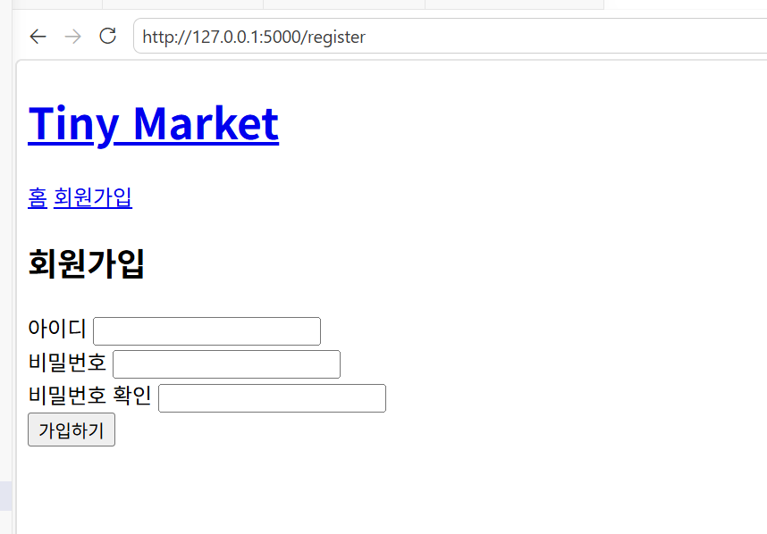

## 2.5 SQLite 데이터베이스 연결

Flask-SQLAlchemy를 이용하여 Flask 애플리케이션과 SQLite 데이터베이스를 연결하였다.

애플리케이션 설정에는 다음과 같은 SQLite 연결 주소를 사용하였다.

```python
app.config["SQLALCHEMY_DATABASE_URI"] = "sqlite:///market.db"
```

데이터베이스 모델을 정의한 후 애플리케이션 실행 과정에서 테이블을 생성하였다.

실행 후 `instance` 폴더 안에 `market.db` 파일이 생성된 것을 확인하였다.


SQLite 데이터베이스 파일에는 사용자 정보, 상품, 메시지, 신고, 송금 기록 등의 테스트 데이터가 포함될 수 있으므로 GitHub 공개 저장소에는 업로드하지 않도록 설정하였다.

---

# 3. 프로젝트 구조

## 3.1 전체 구조

프로젝트의 주요 디렉터리와 파일 구조는 다음과 같다.

```text
secure-secondhand-platform/
├── app.py
├── models.py
├── requirements.txt
├── README.md
├── .gitignore
│
├── templates/
│   ├── base.html
│   ├── index.html
│   ├── register.html
│   ├── login.html
│   ├── mypage.html
│   ├── products.html
│   ├── product_detail.html
│   ├── product_form.html
│   ├── messages.html
│   ├── conversation.html
│   ├── transfer.html
│   ├── transactions.html
│   ├── report_form.html
│   └── admin/
│
├── static/
│   └── style.css
│
├── instance/
│   └── market.db
│
├── evidence/
│   ├── sql_injection_login_blocked.png
│   ├── sql_injection_search_blocked.png
│   └── xss_bio_escaped.png
│
└── docs/
    ├── requirements.md
    ├── design.md
    ├── security.md
    ├── checklist.md
    ├── test.md
    ├── maintenance.md
    └── report.md
```

실제 파일 구성은 개발 과정에서 일부 차이가 있을 수 있으나, 역할에 따라 소스코드, 템플릿, 정적 파일, 데이터베이스, 테스트 증거, 문서를 구분하여 관리하였다.

## 3.2 주요 파일 역할

| 파일 또는 폴더 | 역할 |
|---|---|
| `app.py` | Flask 애플리케이션 실행, URL 라우팅, 입력값 검증 및 기능 처리 |
| `models.py` | User, Product, Message, Report, Transaction 데이터베이스 모델 정의 |
| `templates/` | Jinja2 기반 HTML 화면 |
| `static/` | CSS 등 정적 파일 |
| `instance/` | SQLite 데이터베이스 파일 저장 |
| `evidence/` | SQL Injection 및 XSS 테스트 증거 화면 |
| `docs/requirements.md` | 기능 및 보안 요구사항 |
| `docs/design.md` | 사용자 역할, 데이터베이스 및 시스템 설계 |
| `docs/security.md` | 적용한 보안 기능 및 미적용 항목 |
| `docs/checklist.md` | 구현 및 보안 점검 결과 |
| `docs/test.md` | 기능 및 보안 테스트 결과 |
| `docs/maintenance.md` | 개발 중 문제와 개선 과정 |
| `docs/report.md` | 프로젝트 전체 개발 보고서 |
| `README.md` | 실행 방법과 프로젝트 소개 |
| `.gitignore` | 가상환경, DB, 임시 파일 등 Git 제외 설정 |

## 3.3 문서 분리 목적

요구사항, 설계, 보안, 테스트, 유지보수 내용을 하나의 파일에 모두 작성하지 않고 목적에 따라 분리하였다.

이를 통해 각 단계에서 작성한 내용을 독립적으로 관리할 수 있었으며, 최종 보고서에서는 여러 문서의 핵심 내용을 종합하여 프로젝트 수행 과정을 정리하였다.

---

# 4. 요구사항 분석

## 4.1 사용자 역할 정의

플랫폼 사용자는 권한에 따라 다음 세 종류로 구분하였다.

| 사용자 구분 | 권한 |
|---|---|
| 비회원 | 메인 화면 조회, 회원가입, 로그인 |
| 일반 사용자 | 상품 관리, 검색, 메시지, 신고, 포인트 송금 |
| 관리자 | 일반 사용자 기능과 사용자·상품·신고 관리 |

비회원은 인증이 필요한 기능에 접근할 수 없으며, 로그인이 필요한 주소에 직접 접근할 경우 로그인 페이지로 이동하도록 요구사항을 정의하였다.

## 4.2 기능 요구사항

### 회원가입

- 사용자는 아이디와 비밀번호를 입력하여 회원가입할 수 있어야 한다.
- 아이디는 중복될 수 없다.
- 아이디와 비밀번호는 서버에서 길이와 형식을 검증해야 한다.
- 비밀번호는 평문이 아닌 해시값으로 저장해야 한다.
- 신규 사용자는 테스트용 기본 포인트를 지급받는다.

### 로그인 및 로그아웃

- 가입된 사용자는 아이디와 비밀번호로 로그인할 수 있어야 한다.
- 로그인 성공 시 사용자 정보를 세션에 저장해야 한다.
- 로그인 실패 시 아이디 존재 여부를 노출하지 않는 동일한 메시지를 사용해야 한다.
- 정지된 사용자는 로그인할 수 없어야 한다.
- 로그아웃 시 세션 정보를 삭제해야 한다.

### 마이페이지

- 로그인한 사용자는 자신의 아이디, 가입일, 포인트, 소개글을 확인할 수 있어야 한다.
- 사용자는 자신의 소개글을 수정할 수 있어야 한다.
- 비로그인 사용자는 마이페이지에 접근할 수 없어야 한다.

### 상품 기능

- 로그인한 사용자는 상품을 등록할 수 있어야 한다.
- 사용자는 전체 상품 목록과 상세 정보를 조회할 수 있어야 한다.
- 상품 등록자는 자신의 상품을 수정하거나 삭제할 수 있어야 한다.
- 관리자는 필요한 경우 상품을 차단할 수 있어야 한다.
- 차단된 상품은 일반 사용자에게 노출되지 않아야 한다.

### 상품 검색

- 사용자는 상품명 또는 설명을 기준으로 상품을 검색할 수 있어야 한다.
- 검색 결과가 없는 경우 안내 메시지를 출력해야 한다.
- 검색어를 SQL 문자열에 직접 결합하지 않아야 한다.

### 메시지

- 로그인한 사용자는 다른 사용자와 1대1 메시지를 주고받을 수 있어야 한다.
- 두 사용자 사이의 메시지만 조회할 수 있어야 한다.
- 발신자 ID는 현재 로그인 세션에서 가져와야 한다.
- 자기 자신이나 정지된 사용자에게 메시지를 보낼 수 없어야 한다.

### 신고

- 사용자는 부적절한 사용자나 상품을 신고할 수 있어야 한다.
- 신고 사유를 입력해야 한다.
- 자기 자신 또는 자신의 상품을 신고할 수 없어야 한다.
- 동일한 대상에 대한 중복 신고를 제한해야 한다.
- 관리자는 신고 내용을 확인하고 처리할 수 있어야 한다.

### 포인트 송금

- 로그인한 사용자는 다른 사용자에게 가상 포인트를 송금할 수 있어야 한다.
- 자기 자신에게는 송금할 수 없어야 한다.
- 존재하지 않거나 정지된 사용자에게 송금할 수 없어야 한다.
- 보유 포인트보다 큰 금액을 송금할 수 없어야 한다.
- 송신자 차감, 수신자 증가, 거래 기록 저장이 함께 처리되어야 한다.

### 관리자 기능

- 관리자는 전체 사용자와 상품을 조회할 수 있어야 한다.
- 관리자는 일반 사용자를 정지하거나 정지를 해제할 수 있어야 한다.
- 관리자는 상품을 차단하거나 차단을 해제할 수 있어야 한다.
- 관리자는 신고를 처리할 수 있어야 한다.
- 일반 사용자는 관리자 기능에 접근할 수 없어야 한다.

## 4.3 보안 요구사항

본 프로젝트의 주요 보안 요구사항은 다음과 같다.

- 비밀번호를 데이터베이스에 평문으로 저장하지 않는다.
- 모든 주요 입력값을 서버에서 검증한다.
- SQL 쿼리에 사용자 입력을 문자열로 직접 연결하지 않는다.
- 로그인 여부와 권한을 서버에서 검사한다.
- 상품 수정과 삭제 시 작성자 여부를 검사한다.
- 관리자 기능은 관리자만 실행할 수 있어야 한다.
- 사용자 입력을 HTML로 직접 실행하지 않는다.
- 메시지 발신자 정보를 사용자가 임의로 지정할 수 없도록 한다.
- 포인트 송금 과정에서 일부 작업만 반영되지 않도록 한다.
- 데이터베이스와 비밀정보를 공개 GitHub 저장소에 업로드하지 않는다.

---

# 5. 시스템 설계

## 5.1 시스템 구성

본 시스템은 Flask 기반의 서버 애플리케이션, Jinja2 HTML 템플릿, SQLite 데이터베이스로 구성하였다.

사용자가 웹 브라우저를 통해 요청을 보내면 Flask 라우트에서 다음 작업을 수행한다.

1. 요청 방식과 로그인 상태를 확인한다.
2. 사용자가 입력한 값을 읽는다.
3. 입력값의 형식, 길이, 범위를 검증한다.
4. 사용자 권한 또는 데이터 소유권을 확인한다.
5. SQLAlchemy ORM을 이용하여 데이터베이스를 조회하거나 변경한다.
6. 처리 결과에 따라 HTML 페이지 또는 안내 메시지를 반환한다.

## 5.2 사용자 권한 설계

### 비회원

비회원은 다음 기능만 이용할 수 있다.

- 메인 화면
- 회원가입
- 로그인

인증이 필요한 기능에 접근하면 로그인 페이지로 이동한다.

### 일반 사용자

일반 사용자는 다음 기능을 이용할 수 있다.

- 마이페이지
- 상품 등록 및 자신의 상품 관리
- 상품 검색
- 메시지
- 신고
- 포인트 송금
- 송금 내역 조회

일반 사용자는 다른 사용자의 상품을 수정하거나 삭제할 수 없으며, 관리자 페이지에도 접근할 수 없다.

### 관리자

관리자는 일반 사용자의 기능과 함께 다음 관리 기능을 사용할 수 있다.

- 사용자 정지 및 해제
- 상품 차단 및 해제
- 신고 처리

관리자 여부는 사용자의 `is_admin` 값을 기준으로 서버에서 확인한다.

## 5.3 데이터베이스 모델 설계

프로젝트에서는 다음 다섯 개의 주요 모델을 사용하였다.

- User
- Product
- Message
- Report
- Transaction

### User 모델

사용자 계정과 권한, 포인트 정보를 저장한다.

| 필드 | 설명 |
|---|---|
| `id` | 사용자 고유 번호 |
| `username` | 로그인 아이디 |
| `password_hash` | 해시된 비밀번호 |
| `bio` | 사용자 소개글 |
| `points` | 보유 가상 포인트 |
| `is_admin` | 관리자 여부 |
| `is_suspended` | 계정 정지 여부 |
| `created_at` | 가입 시간 |

### Product 모델

사용자가 등록한 중고 상품 정보를 저장한다.

| 필드 | 설명 |
|---|---|
| `id` | 상품 고유 번호 |
| `title` | 상품명 |
| `description` | 상품 설명 |
| `price` | 상품 가격 |
| `seller_id` | 등록 사용자 ID |
| `is_blocked` | 관리자 차단 여부 |
| `created_at` | 등록 시간 |

### Message 모델

사용자 간 메시지를 저장한다.

| 필드 | 설명 |
|---|---|
| `id` | 메시지 고유 번호 |
| `sender_id` | 발신자 ID |
| `receiver_id` | 수신자 ID |
| `content` | 메시지 내용 |
| `created_at` | 작성 시간 |

### Report 모델

사용자 또는 상품 신고 정보를 저장한다.

| 필드 | 설명 |
|---|---|
| `id` | 신고 고유 번호 |
| `reporter_id` | 신고자 ID |
| `target_user_id` | 신고 대상 사용자 ID |
| `target_product_id` | 신고 대상 상품 ID |
| `reason` | 신고 사유 |
| `status` | 신고 처리 상태 |
| `created_at` | 신고 시간 |

신고 대상 종류에 따라 사용자 ID 또는 상품 ID 중 하나를 저장하도록 설계하였다.

### Transaction 모델

사용자 간 포인트 송금 기록을 저장한다.

| 필드 | 설명 |
|---|---|
| `id` | 거래 고유 번호 |
| `sender_id` | 송신자 ID |
| `receiver_id` | 수신자 ID |
| `amount` | 송금 포인트 |
| `created_at` | 송금 시간 |

## 5.4 모델 관계

데이터베이스 모델은 사용자 ID를 기준으로 연결된다.

- 한 명의 사용자는 여러 상품을 등록할 수 있다.
- 한 명의 사용자는 여러 메시지를 보내거나 받을 수 있다.
- 한 명의 사용자는 여러 신고를 등록할 수 있다.
- 한 명의 사용자는 여러 포인트 거래의 송신자 또는 수신자가 될 수 있다.
- 하나의 상품은 한 명의 판매자에게 연결된다.

## 5.5 보안 설계

시스템 설계 단계에서 다음 보안 원칙을 적용하였다.

### 최소 권한

일반 사용자와 관리자의 권한을 분리하고, 필요한 기능에만 접근하도록 설계하였다.

### 서버 측 검증

HTML 폼의 제한만 신뢰하지 않고 서버에서도 모든 주요 입력값을 다시 검사하도록 설계하였다.

### 세션 기반 인증

사용자의 로그인 상태는 Flask 세션에 저장된 사용자 ID를 기준으로 판단하도록 하였다.

### 소유권 검증

상품 수정과 삭제 시 URL에 포함된 상품 ID만 신뢰하지 않고, 상품의 판매자 ID와 로그인 사용자 ID를 비교하도록 설계하였다.

### ORM 사용

사용자 입력값을 SQL 문자열에 직접 연결하지 않고 SQLAlchemy ORM을 이용하도록 설계하였다.

### 출력 이스케이프

사용자 입력값은 Jinja2의 기본 자동 이스케이프를 통해 HTML 코드가 실행되지 않도록 설계하였다.

---

# 6. 주요 기능 구현

## 6.1 회원가입 구현

사용자가 아이디와 비밀번호를 입력하여 새로운 계정을 생성할 수 있도록 회원가입 기능을 구현하였다.

회원가입 요청이 들어오면 서버에서 다음 항목을 검증한다.

- 아이디 입력 여부
- 아이디 길이
- 아이디 형식
- 아이디 중복 여부
- 비밀번호 길이
- 비밀번호 확인 일치 여부

아이디는 영문과 숫자로만 구성되도록 하였으며, 4자 이상 30자 이하로 제한하였다.

비밀번호는 8자 이상 입력하도록 하였으며, 비밀번호와 비밀번호 확인 값이 일치하는지 검사하였다.

이미 존재하는 아이디로 회원가입을 시도하면 새로운 계정을 생성하지 않고 중복 아이디 안내 메시지를 출력하도록 구현하였다.

> 

## 6.2 비밀번호 해시 저장

회원가입 과정에서 사용자가 입력한 비밀번호 원문을 데이터베이스에 직접 저장하지 않았다.

Werkzeug의 `generate_password_hash()` 함수를 사용하여 비밀번호를 해시값으로 변환한 후 `password_hash` 필드에 저장하였다.

```python
password_hash = generate_password_hash(password)
```

이 방식은 데이터베이스가 노출되더라도 사용자의 실제 비밀번호가 그대로 확인되는 위험을 줄인다.

회원가입이 정상적으로 완료되면 메인 페이지로 이동하며 회원가입 완료 메시지를 출력하도록 구현하였다.

> 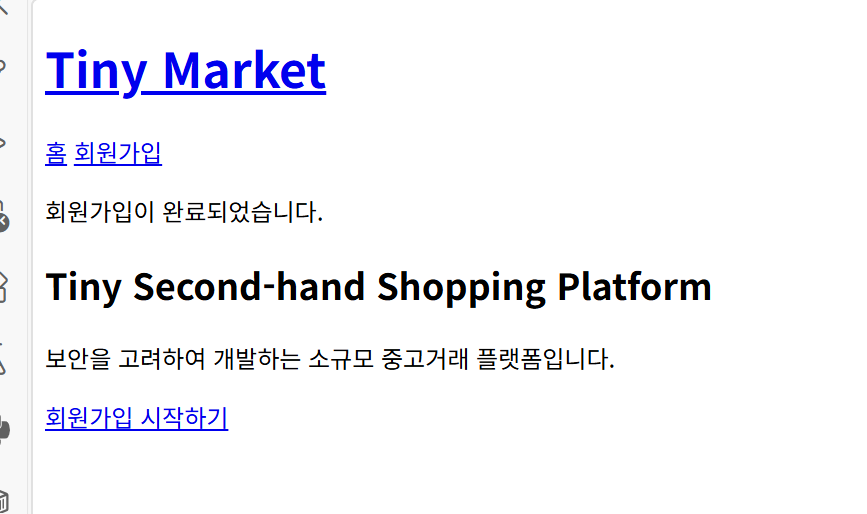

## 6.3 로그인 구현

가입된 사용자가 아이디와 비밀번호를 이용하여 로그인할 수 있도록 구현하였다.

서버에서는 입력된 아이디를 기준으로 사용자를 조회한 뒤, Werkzeug의 `check_password_hash()` 함수를 이용하여 입력된 비밀번호와 저장된 해시값을 비교하였다.

```python
check_password_hash(user.password_hash, password)
```

아이디가 존재하지 않는 경우와 비밀번호가 틀린 경우를 구분하지 않고 다음과 같은 동일한 오류 메시지를 사용하였다.

```text
아이디 또는 비밀번호가 올바르지 않습니다.
```

이를 통해 공격자가 로그인 오류 메시지만으로 특정 아이디의 가입 여부를 추측하기 어렵도록 하였다.

정지된 사용자가 올바른 비밀번호를 입력하더라도 로그인을 허용하지 않도록 구현하였다.

## 6.4 세션 관리

로그인에 성공하면 Flask 세션에 현재 사용자의 ID를 저장하였다.

기존 세션 데이터가 남아 있는 상황을 방지하기 위해 로그인 성공 시 기존 세션을 초기화한 후 사용자 ID를 저장하도록 하였다.

로그아웃 시에는 세션 전체를 삭제하여 로그인 상태를 종료하였다.

비로그인 사용자가 로그인이 필요한 페이지에 접근하면 로그인 페이지로 이동하도록 구현하였다.

## 6.5 로그인 및 로그아웃 테스트

| 테스트 항목 | 입력 또는 동작 | 기대 결과 | 실제 결과 | 판정 |
|---|---|---|---|---|
| 잘못된 비밀번호 | `testuser`와 잘못된 비밀번호 입력 | 로그인 실패 | 동일한 로그인 실패 메시지 출력 | PASS |
| 정상 로그인 | `testuser`와 정상 비밀번호 입력 | 로그인 성공 | 사용자명과 보유 포인트 표시 | PASS |
| 로그인 상태에서 회원가입 접근 | `/register` 주소 직접 입력 | 회원가입 접근 차단 | 이미 로그인되어 있다는 메시지 출력 | PASS |
| 로그아웃 | 로그아웃 버튼 선택 | 세션 종료 | 비회원 메인 화면으로 이동 | PASS |
| 정지 사용자 로그인 | 정지된 계정으로 로그인 | 로그인 차단 | 정지 계정 안내 후 로그인 실패 | PASS |

> 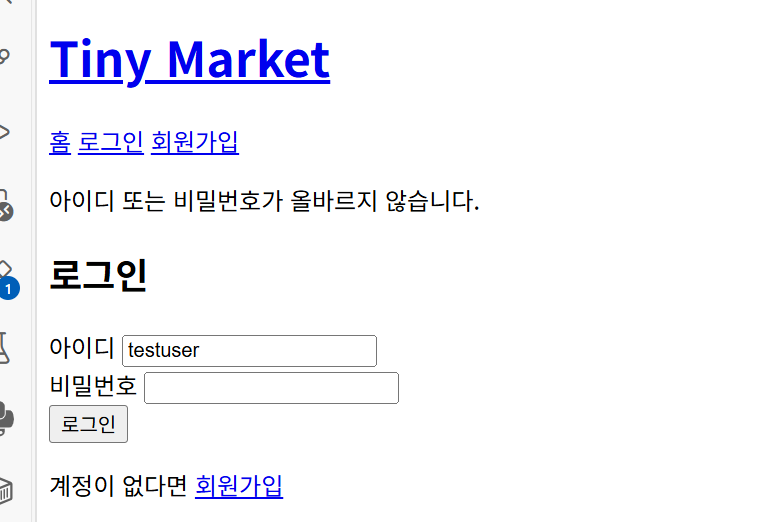

> 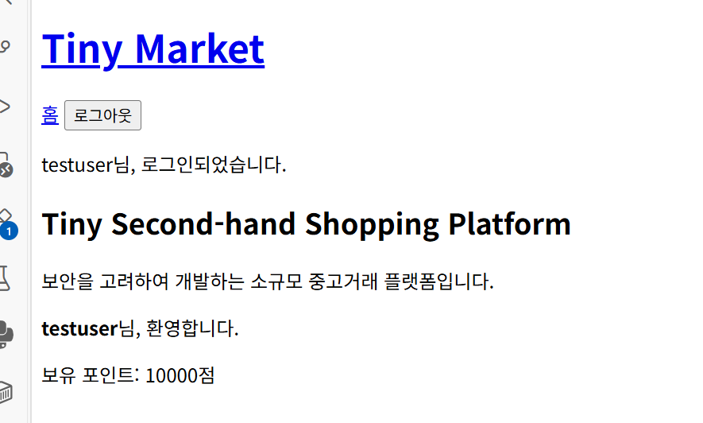

>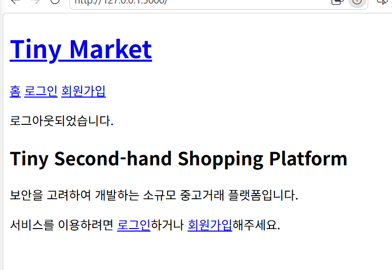

## 6.6 마이페이지 구현

로그인한 사용자가 자신의 계정 정보를 확인할 수 있도록 마이페이지를 구현하였다.

마이페이지에서는 다음 정보를 표시한다.

- 아이디
- 가입일
- 보유 포인트
- 소개글

비로그인 사용자가 `/mypage` 주소에 직접 접근하는 경우 로그인 페이지로 이동하도록 구현하였다.

이를 통해 인증되지 않은 사용자가 사용자 정보를 조회하거나 수정하는 것을 방지하였다.

>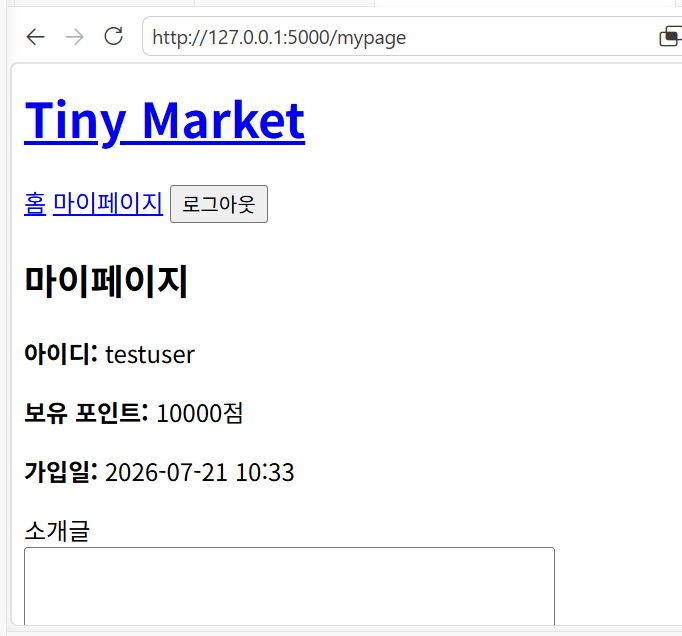

## 6.7 소개글 수정

사용자는 마이페이지에서 자신의 소개글을 입력하거나 수정할 수 있다.

소개글은 서버에서 최대 300자로 제한하였으며, 검증을 통과한 경우 데이터베이스에 저장하였다.

수정이 완료되면 마이페이지로 다시 이동하며 소개글 수정 완료 메시지를 출력하도록 하였다.

사용자가 입력한 소개글은 Jinja2 템플릿을 통해 출력되며, HTML 자동 이스케이프가 적용된다.

따라서 소개글에 HTML 태그나 스크립트 문자열을 입력하더라도 브라우저에서 직접 실행되지 않도록 구성하였다.

> 

> 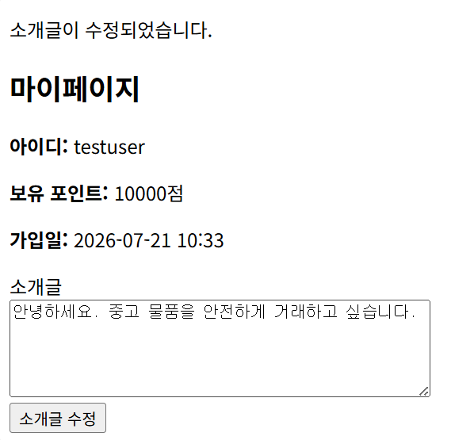

## 6.8 초기 구현 단계의 보안 적용 결과

회원가입, 로그인, 세션, 마이페이지 구현 과정에서 적용한 보안 항목은 다음과 같다.

| 보안 항목 | 적용 여부 |
|---|---|
| 비밀번호 평문 저장 금지 | 적용 |
| 비밀번호 해시 저장 | 적용 |
| 아이디 중복 검사 | 적용 |
| 아이디 및 비밀번호 길이 검증 | 적용 |
| 로그인 오류 메시지 통일 | 적용 |
| 정지 사용자 로그인 차단 | 적용 |
| 세션 기반 인증 | 적용 |
| 비로그인 마이페이지 접근 차단 | 적용 |
| 소개글 길이 서버 검증 | 적용 |
| Jinja2 자동 이스케이프 | 적용 |
| SQLAlchemy ORM | 적용 |

# 7. 상품 관리 기능 구현

## 7.1 구현 목적

중고거래 플랫폼의 핵심 기능인 상품 등록, 조회, 수정, 삭제 기능을 구현하였다.
사용자는 자신이 판매하고자 하는 상품을 등록할 수 있으며, 등록된 상품은 다른 사용자들이 조회할 수 있도록 설계하였다.

상품 정보는 Product 테이블에 저장되며, 제목, 설명, 가격, 작성자 정보, 등록 시간을 관리하도록 구현하였다.

---

## 7.2 상품 등록

상품 등록 화면에서는 다음 정보를 입력받는다.

- 상품명
- 상품 설명
- 판매 가격

등록 요청이 들어오면 서버에서는 다음 항목을 검증한다.

- 로그인 여부
- 제목 입력 여부
- 설명 입력 여부
- 가격 숫자 여부
- 가격이 1 이상인지 확인

입력값 검증이 완료되면 데이터베이스에 새로운 상품을 저장하며,
상품 목록에서 즉시 확인할 수 있도록 구현하였다.


- 상품 등록 화면
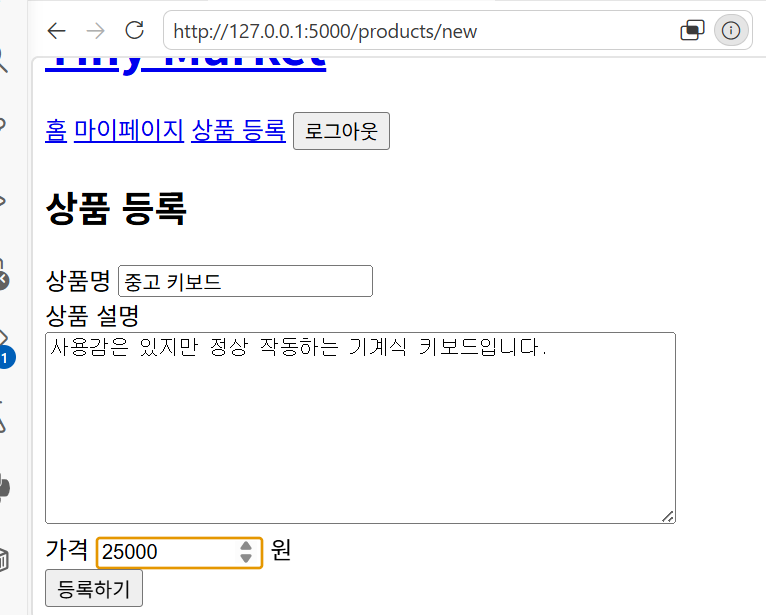

- 상품 등록 완료 화면
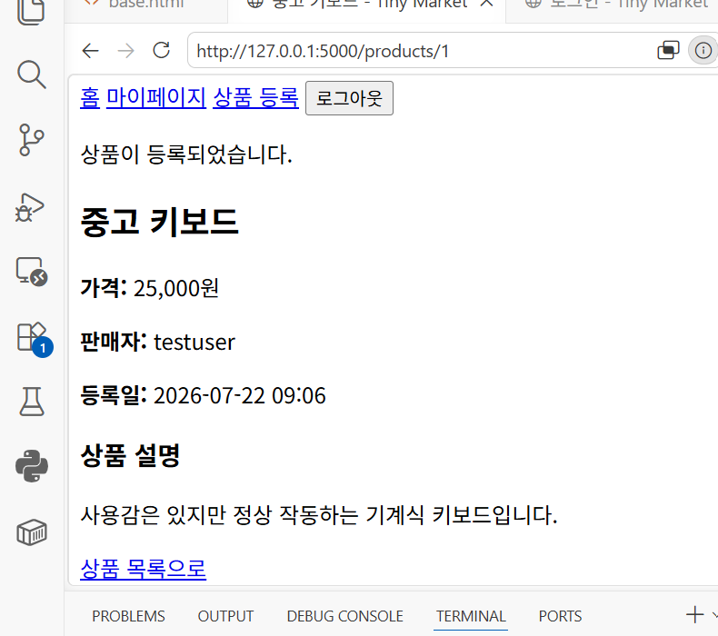

---

## 7.3 상품 조회

등록된 상품은 메인 페이지에서 목록 형태로 출력되도록 구현하였다.

상품 목록에서는 다음 정보를 확인할 수 있다.

- 상품명
- 가격
- 작성자
- 등록 시간

상품을 선택하면 상세 페이지로 이동하여 상품 설명과 판매자 정보를 확인할 수 있도록 구현하였다.

---

## 7.4 상품 수정

상품 수정 기능은 작성자 본인만 사용할 수 있도록 구현하였다.

상품 수정 요청이 들어오면 서버에서는 다음 내용을 확인한다.

- 로그인 여부
- 작성자 여부
- 입력값 검증

작성자가 아닌 사용자가 URL을 직접 입력하여 접근하는 경우 수정이 불가능하도록 서버에서 권한을 검사하였다.

---

## 7.5 상품 삭제

상품 삭제 기능 역시 작성자 본인만 사용할 수 있도록 구현하였다.

삭제 요청 시 서버에서 작성자 여부를 다시 확인하며,
삭제가 완료되면 상품 목록에서 즉시 제거되도록 구현하였다.

이를 통해 다른 사용자가 임의로 상품을 삭제하는 것을 방지하였다.

---

# 8. 상품 검색 기능 구현

사용자가 원하는 상품을 빠르게 찾을 수 있도록 검색 기능을 구현하였다.

검색은 상품명과 상품 설명을 기준으로 수행하였다.

SQLAlchemy ORM을 이용하여 LIKE 검색을 구현하였으며,
사용자가 입력한 검색어를 SQL 문자열에 직접 연결하지 않도록 작성하였다.

검색 결과가 존재하지 않는 경우에는 사용자에게 검색 결과가 없음을 안내하도록 구현하였다.


- 검색 화면
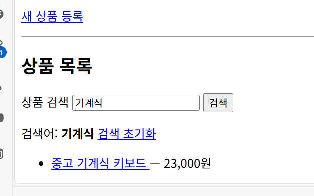

---

# 9. 1대1 메시지 기능 구현

사용자 간 거래 문의가 가능하도록 1대1 메시지 기능을 구현하였다.

메시지는 발신자 ID, 수신자 ID, 내용, 작성 시간을 데이터베이스에 저장하도록 구현하였다.

또한 두 사용자 사이의 대화만 조회하도록 구현하여 다른 사용자의 메시지가 노출되지 않도록 하였다.

메시지 작성 시 발신자 ID는 클라이언트에서 전달받지 않고 현재 로그인한 세션의 사용자 정보를 사용하였다.

이를 통해 발신자 위조를 방지하였다.

메시지 입력 시 서버에서는 다음 사항을 검증한다.

- 로그인 여부
- 자기 자신에게 메시지 전송 금지
- 정지된 사용자 여부
- 메시지 길이(1~1000자)

위 조건을 만족하는 경우에만 메시지를 저장하도록 구현하였다.


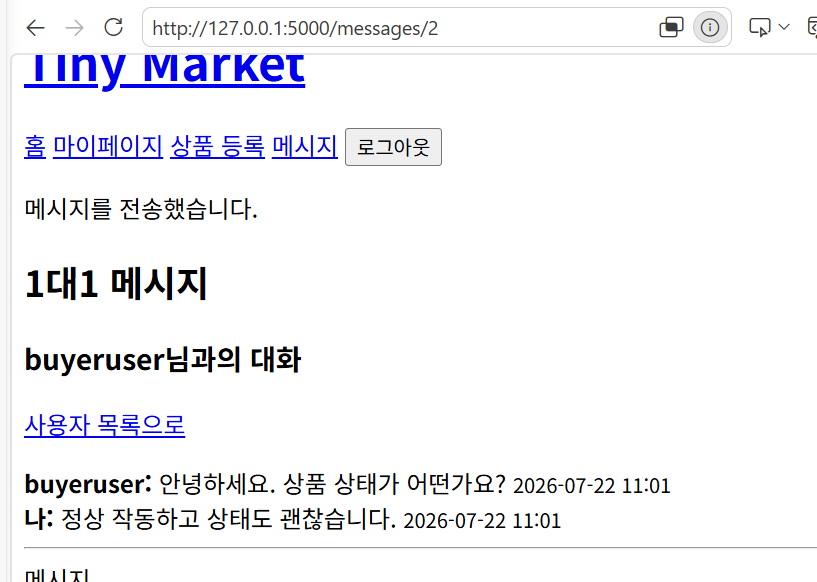

---

# 10. 신고 기능 구현

플랫폼 내 부적절한 상품 및 사용자를 신고할 수 있도록 신고 기능을 구현하였다.

신고 시 다음 정보를 입력받는다.

- 신고 대상
- 신고 사유

신고 내용은 Report 테이블에 저장되며 관리자가 확인 후 처리하도록 설계하였다.

동일한 신고가 발생하더라도 관리자가 직접 검토할 수 있도록 신고 내역을 보관하도록 구현하였다.

또한 일반 사용자는 자신이 등록한 신고를 수정하거나 처리할 수 없도록 권한을 제한하였다.


- 신고 작성 화면
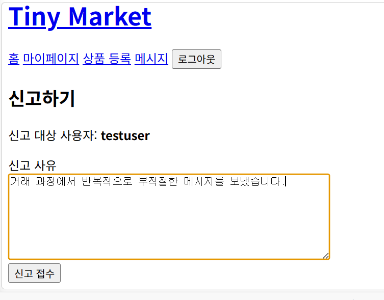

- 신고 완료 화면
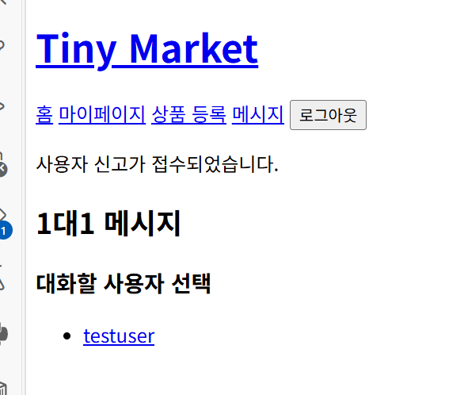

---

# 11. 관리자 기능 구현

관리자는 일반 사용자보다 높은 권한을 가지도록 구현하였다.

관리자 계정으로 로그인하면 관리자 전용 페이지에 접근할 수 있다.

관리자가 수행할 수 있는 기능은 다음과 같다.

- 전체 사용자 조회
- 사용자 정지
- 상품 차단
- 신고 처리

관리자 페이지 접근 시 서버에서 관리자 권한을 확인하며,
일반 사용자가 URL을 직접 입력하더라도 접근이 거부되도록 구현하였다.

또한 정지된 사용자는 로그인 및 주요 기능 사용이 제한되도록 설계하였다.


- 관리자 메인 화면
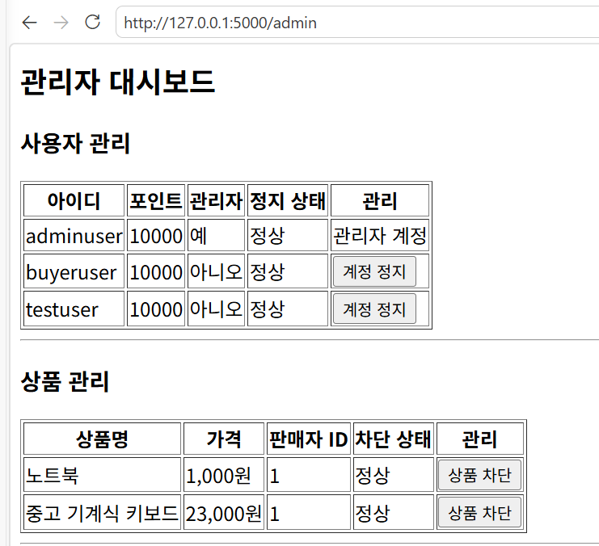


---

# 12. 포인트 송금 기능 구현

## 12.1 구현 목적

사용자 간에 플랫폼 내부의 가상 포인트를 안전하게 송금할 수 있도록 포인트 송금 기능을 구현하였다.

본 프로젝트의 포인트는 실제 현금이나 금융 결제가 아닌 학습용 가상 포인트이다. 신규 사용자는 테스트를 위해 기본적으로 10,000점을 지급받으며, 로그인한 사용자는 자신이 보유한 포인트 범위 안에서 다른 사용자에게 포인트를 송금할 수 있다.

송금 기능에서는 송신자의 포인트 차감, 수신자의 포인트 증가, 송금 기록 저장이 모두 함께 처리되어야 한다. 따라서 일부 작업만 반영되어 사용자 잔액이 불일치하는 상황을 방지하는 것을 중요한 구현 목표로 설정하였다.

---

## 12.2 구현 내용

포인트 송금 기능은 다음과 같이 구성하였다.

- 수신 사용자 아이디 입력
- 송금할 포인트 입력
- 현재 보유 포인트 표시
- 송신자 포인트 차감
- 수신자 포인트 증가
- 송금 기록 저장
- 송금 내역 조회

사용자가 송금 화면에서 수신자의 아이디와 송금액을 입력하면, 서버는 수신 사용자의 존재 여부와 송금 가능 여부를 검사한다.

모든 조건을 만족하면 다음 작업을 수행한다.

1. 송신자의 보유 포인트에서 송금액을 차감한다.
2. 수신자의 보유 포인트에 송금액을 더한다.
3. `Transaction` 테이블에 송금 기록을 생성한다.
4. 하나의 `commit()`으로 데이터베이스에 저장한다.

송금 기록에는 다음 정보가 저장된다.

- 송신자 ID
- 수신자 ID
- 송금 포인트
- 송금 시간

사용자는 송금 내역 페이지에서 자신이 송금하거나 수신한 거래만 확인할 수 있다.

---

## 12.3 서버 측 검증

클라이언트에서 전달한 입력값을 그대로 신뢰하지 않고 서버에서 다음 항목을 검증하였다.

- 로그인 사용자만 송금 가능
- 현재 로그인 사용자의 계정 존재 여부 확인
- 정지된 계정의 송금 차단
- 수신 사용자 존재 여부 확인
- 자기 자신에게 송금 차단
- 정지된 사용자에게 송금 차단
- 송금액의 정수 변환 가능 여부 확인
- 0 이하의 송금액 차단
- 보유 포인트를 초과한 송금 차단

송신자 ID는 사용자가 요청값으로 제출하지 않으며, Flask 세션에 저장된 현재 로그인 사용자 ID를 사용하였다. 이를 통해 다른 사용자의 ID를 송신자로 지정하는 행위를 방지하였다.

---

## 12.4 트랜잭션 처리

포인트 송금은 송신자와 수신자의 잔액을 동시에 변경해야 한다.

다음 세 작업을 하나의 데이터베이스 처리 흐름으로 구성하였다.

1. 송신자 포인트 차감
2. 수신자 포인트 증가
3. 송금 기록 저장

정상 처리 시 한 번의 `commit()`으로 저장하며, 처리 도중 예외가 발생한 경우 `rollback()`을 수행하도록 구현하였다.

이를 통해 다음과 같은 불완전한 처리 가능성을 줄였다.

- 송신자의 포인트만 차감되는 문제
- 수신자의 포인트만 증가하는 문제
- 포인트는 이동했지만 송금 기록이 저장되지 않는 문제

다만 다수의 송금 요청이 동시에 처리되는 경쟁 상태에 대해서는 별도의 동시성 검증을 수행하지 않았다. 실제 운영환경에서는 데이터베이스 잠금이나 원자적 조건부 갱신 등의 추가 보호가 필요하다.

---

## 12.5 테스트 결과

포인트 송금 기능의 테스트 결과는 다음과 같다.

| 번호 | 테스트 내용 | 입력 또는 동작 | 기대 결과 | 실제 결과 | 판정 |
|---|---|---|---|---|---|
| PAY-01 | 정상 송금 | `buyeruser`가 `testuser`에게 1,500점 송금 | 송신자 차감, 수신자 증가, 기록 저장 | 송신자 포인트가 10,000점에서 8,500점으로 변경됨 | PASS |
| PAY-02 | 수신자 잔액 확인 | `testuser` 계정으로 잔액 확인 | 11,500점 표시 | 현재 포인트 11,500점 표시 | PASS |
| PAY-03 | 잔액 초과 송금 | 보유 포인트보다 큰 금액 입력 | 송금 차단 및 기존 잔액 유지 | 포인트 부족 메시지가 출력되고 잔액 유지 | PASS |
| PAY-04 | 자기 자신에게 송금 | 수신자에 자신의 아이디 입력 | 송금 차단 | 자기 자신에게 송금할 수 없다는 메시지 출력 | PASS |
| PAY-05 | 존재하지 않는 사용자 | 존재하지 않는 아이디 입력 | 송금 차단 | 사용자를 찾을 수 없다는 메시지 출력 | PASS |
| PAY-06 | 데이터베이스 처리 | 포인트 변경과 기록 저장 | 하나의 처리 흐름으로 반영 | `commit()`과 오류 시 `rollback()` 구조 적용 | PASS |

> 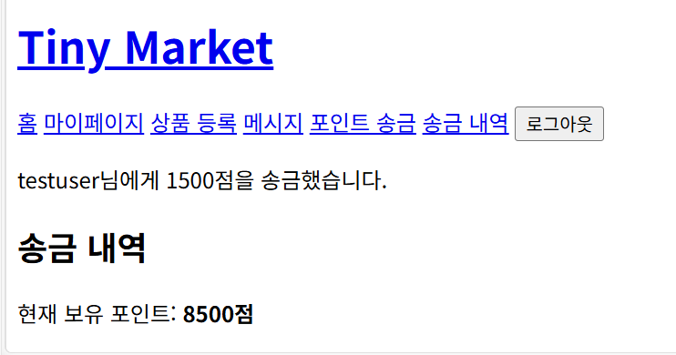

> 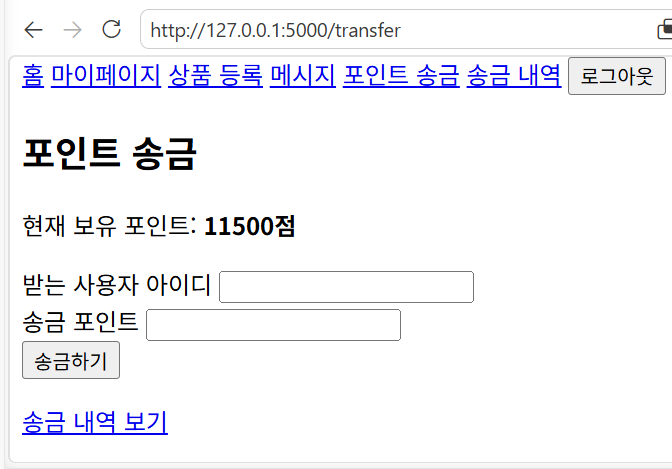

> 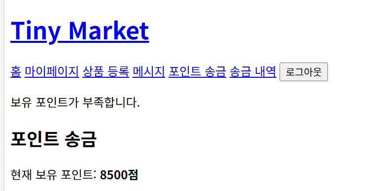

> 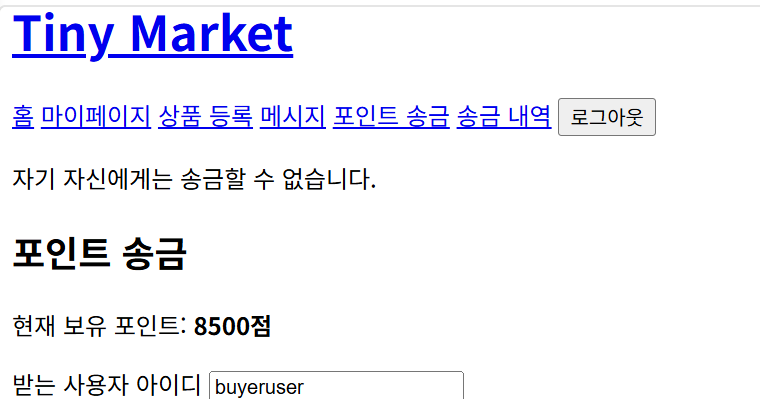

> 

---

# 13. 적용한 보안 기능

## 13.1 보안 구현 개요

본 프로젝트는 기능 구현뿐 아니라 중고거래 플랫폼에서 발생할 수 있는 기본적인 보안 문제를 확인하고 개선하는 것을 목표로 하였다.

주요 보안 적용 항목은 다음과 같다.

| 보안 항목 | 적용 내용 |
|---|---|
| 비밀번호 보호 | Werkzeug를 이용한 해시 저장 |
| 입력값 검증 | 회원가입, 상품, 소개글, 메시지, 신고, 송금 입력값 서버 검증 |
| 사용자 인증 | Flask 세션 기반 로그인 상태 관리 |
| 접근 제어 | 상품 소유권 및 관리자 권한 서버 측 검사 |
| SQL Injection 대응 | Flask-SQLAlchemy ORM 사용 |
| XSS 대응 | Jinja2 기본 자동 이스케이프 사용 |
| 메시지 위조 방지 | 발신자 ID를 세션에서 지정 |
| 송금 무결성 | 하나의 `commit()`과 오류 시 `rollback()` 적용 |
| 민감 파일 보호 | 데이터베이스와 가상환경을 GitHub 업로드 대상에서 제외 |

---

## 13.2 비밀번호 해시 저장

사용자의 비밀번호를 데이터베이스에 평문으로 저장하지 않았다.

회원가입 시 Werkzeug의 `generate_password_hash()` 함수를 사용하여 비밀번호를 해시값으로 변환한 뒤 저장하였다.

로그인 시에는 사용자가 입력한 비밀번호와 데이터베이스에 저장된 해시값을 `check_password_hash()` 함수로 비교하였다.

따라서 데이터베이스가 노출되더라도 사용자의 비밀번호 원문이 그대로 확인되지 않도록 하였다.

---

## 13.3 입력값 검증

HTML 입력 요소의 `min`, `maxlength` 등의 속성만으로는 개발자 도구나 직접 요청을 이용한 우회가 가능하다.

따라서 모든 주요 입력값은 서버에서 다시 검증하였다.

### 회원가입 검증

- 아이디 길이: 4자 이상 30자 이하
- 아이디 문자: 영문과 숫자만 허용
- 비밀번호 길이: 8자 이상
- 비밀번호 확인 일치 여부
- 중복 아이디 여부

### 마이페이지 검증

- 소개글 길이: 300자 이하

### 상품 검증

- 상품명 길이: 2자 이상 100자 이하
- 상품 설명 길이: 1자 이상 2,000자 이하
- 가격 정수 변환 여부
- 가격 범위: 1원 이상 1억 원 이하

### 메시지 검증

- 메시지 길이: 1자 이상 1,000자 이하
- 자기 자신에게 메시지 전송 차단
- 정지된 사용자와의 메시지 차단

### 신고 검증

- 신고 사유 길이: 5자 이상 500자 이하
- 자기 자신 신고 차단
- 자신이 등록한 상품 신고 차단
- 동일 대상 중복 신고 차단

### 송금 검증

- 수신 사용자 존재 여부
- 정지된 사용자 여부
- 자기 자신에게 송금 차단
- 송금액 정수 변환 여부
- 0 이하의 금액 차단
- 보유 포인트 초과 여부

---

## 13.4 인증과 세션 관리

로그인에 성공하면 사용자 ID를 Flask 세션에 저장하였다.

로그인 시 기존 세션을 먼저 초기화한 후 현재 사용자의 ID를 새로 저장하도록 하였다.

로그아웃 요청 시에는 세션 전체를 삭제하였다.

세션에 저장된 사용자 ID가 실제 데이터베이스에 존재하지 않는 경우에도 세션을 초기화하도록 구현하였다.

로그인이 필요한 페이지에서는 세션에 사용자 ID가 있는지 확인하고, 비로그인 사용자가 접근할 경우 로그인 페이지로 이동하도록 하였다.

---

## 13.5 권한 검증

화면에서 버튼을 숨기는 것만으로는 권한을 보호할 수 없다. 사용자는 URL을 직접 입력하거나 HTTP 요청을 수정할 수 있기 때문이다.

따라서 상품 수정, 상품 삭제, 관리자 기능 등 중요한 작업은 요청이 서버에 도착했을 때 다시 권한을 검사하도록 하였다.

### 상품 소유권 검증

상품 수정과 삭제는 다음 사용자만 수행할 수 있다.

- 상품 등록자
- 관리자

일반 사용자가 URL의 상품 ID를 변경하여 타인의 상품에 접근하더라도, 상품의 `seller_id`와 로그인 사용자 ID를 비교하여 작업을 차단한다.

### 관리자 권한 검증

관리자 관련 요청은 `is_admin` 값이 참인 사용자만 수행할 수 있다.

일반 사용자가 `/admin` 주소에 직접 접근하더라도 관리자 페이지가 표시되지 않도록 하였다.

관리자는 자신의 관리자 계정이나 다른 관리자 계정을 정지할 수 없도록 제한하였다.

---

## 13.6 SQL Injection 대응

본 프로젝트는 SQLAlchemy ORM을 사용하였다.

사용자 입력값을 SQL 문자열에 직접 이어 붙이지 않고 ORM의 조회 조건으로 전달하였다.

로그인 사용자를 조회할 때는 다음과 같이 아이디를 조건으로 검색하였다.

```python
user = User.query.filter_by(username=username).first()
```

상품 검색 역시 ORM의 `contains()` 조건을 사용하여 상품명과 설명을 검색하였다.

```python
products_query = products_query.filter(
    Product.title.contains(search_query)
    | Product.description.contains(search_query)
)
```

이 방식은 사용자 입력이 SQL 명령어 자체로 실행되는 위험을 줄인다.

---

## 13.7 XSS 대응

Flask의 Jinja2 템플릿은 기본적으로 HTML 자동 이스케이프를 적용한다.

사용자가 작성한 다음 내용은 HTML 코드로 직접 실행하지 않고 텍스트로 출력하도록 구성하였다.

- 소개글
- 상품명
- 상품 설명
- 메시지
- 신고 사유

템플릿에서 사용자 입력에 `safe` 필터를 사용하지 않았다.

저장형 XSS 테스트를 통해 소개글에 입력한 스크립트가 실행되지 않고 문자열로 표시되는 것을 확인하였다.

---

## 13.8 포인트 송금 무결성

포인트 송금에서는 송신자 잔액 차감, 수신자 잔액 증가, 거래 기록 저장을 하나의 흐름으로 처리하였다.

정상 처리 시 한 번의 `commit()`으로 저장하며, 예외가 발생하면 `rollback()`을 수행한다.

이를 통해 일부 데이터만 반영되는 문제를 줄였다.

---

# 14. 보안 테스트

## 14.1 테스트 목적

보안 기능이 코드에 존재하는지만 확인하지 않고 실제 공격 문자열을 입력하여 기본적인 동작을 확인하였다.

수행한 주요 테스트는 다음과 같다.

- 로그인 SQL Injection 테스트
- 상품 검색 SQL Injection 테스트
- 마이페이지 소개글 저장형 XSS 테스트

---

## 14.2 로그인 SQL Injection 테스트

로그인 화면의 아이디 입력란에 다음 문자열을 입력하였다.

```text
' OR 1=1 --
```

일반적인 취약한 로그인 코드에서는 위 문자열이 SQL 조건을 항상 참으로 만들어 인증을 우회할 가능성이 있다.

본 프로젝트에서는 SQLAlchemy ORM을 사용하여 아이디를 조회하므로 입력 문자열이 SQL 명령문으로 결합되지 않고 하나의 사용자 아이디 값으로 처리된다.

### 테스트 결과

- 로그인 인증을 우회하지 못하였다.
- 관리자 또는 다른 사용자 계정으로 로그인되지 않았다.
- 서버 오류가 발생하지 않았다.
- “아이디 또는 비밀번호가 올바르지 않습니다.”라는 일반적인 로그인 실패 메시지가 출력되었다.

### 판정

`PASS`

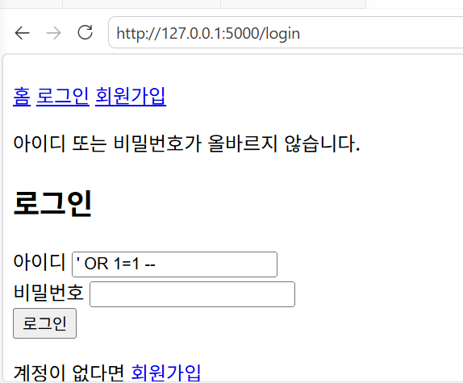

---

## 14.3 상품 검색 SQL Injection 테스트

상품 검색창에 다음 문자열을 입력하였다.

```text
' OR 1=1 --
```

검색 기능은 SQLAlchemy ORM의 `contains()` 조건을 사용하여 구현하였다.

### 테스트 결과

- 서버 오류가 발생하지 않았다.
- 전체 상품이 강제로 노출되지 않았다.
- SQL 명령문으로 실행되지 않았다.
- 입력 문자열이 일반적인 검색어로 처리되었다.

### 판정

`PASS`

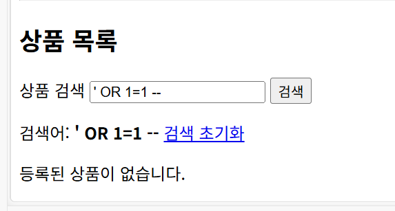

---

## 14.4 저장형 XSS 테스트

마이페이지 소개글에 다음 문자열을 입력하여 저장하였다.

```html
<script>alert(1)</script>
```

저장형 XSS 취약점이 존재하는 경우 페이지를 다시 열었을 때 브라우저에서 `alert(1)` 경고창이 실행될 수 있다.

### 테스트 결과

- 브라우저 경고창이 실행되지 않았다.
- 스크립트가 HTML 코드로 처리되지 않았다.
- 입력 문자열이 화면에 텍스트 형태로 표시되었다.

Jinja2의 기본 자동 이스케이프가 적용되었으며, 사용자 입력을 출력하는 위치에서 `safe` 필터를 사용하지 않았기 때문에 스크립트가 실행되지 않은 것으로 확인하였다.

### 판정

`PASS`

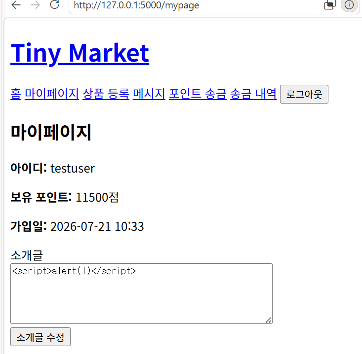

---

## 14.5 전체 테스트 결과

| 구분 | 테스트 결과 |
|---|---|
| 회원가입 및 로그인 | 정상 동작 |
| 마이페이지 | 정상 동작 |
| 상품 등록·조회·수정·삭제 | 정상 동작 |
| 상품 검색 | 정상 동작 |
| 사용자 간 메시지 | 정상 동작 |
| 사용자 및 상품 신고 | 정상 동작 |
| 관리자 사용자·상품·신고 관리 | 정상 동작 |
| 가상 포인트 송금 | 정상 동작 |
| SQL Injection 로그인 테스트 | PASS |
| SQL Injection 검색 테스트 | PASS |
| 저장형 XSS 소개글 테스트 | PASS |
| CSRF 방어 | 미적용 |
| 메시지·상품·신고 위치의 추가 XSS 동적 테스트 | 추가 검증 필요 |

테스트 결과 과제에서 요구한 핵심 기능은 정상적으로 작동하였다.

SQL Injection 로그인 우회와 검색 기능 공격 테스트에서는 인증 우회나 데이터 노출이 발생하지 않았다.

소개글 저장형 XSS 테스트에서도 스크립트가 실행되지 않고 텍스트로 출력되는 것을 확인하였다.

---

# 15. 현재 제한사항 및 잔여 보안 위험

현재 프로젝트는 교육 및 로컬 테스트를 목적으로 개발하였다.

다음 항목은 현재 버전에 적용되지 않았거나 추가적인 개선이 필요하다.

## 15.1 CSRF 방어 미적용

상품 삭제, 소개글 수정, 메시지 전송, 신고, 송금, 관리자 상태 변경 등의 POST 요청에 CSRF 토큰이 적용되지 않았다.

향후 Flask-WTF의 `CSRFProtect`를 적용하여 외부 사이트에서 로그인 사용자의 권한을 악용한 요청을 보내는 것을 방지해야 한다.

---

## 15.2 SECRET_KEY 코드 내부 저장

현재 Flask의 `SECRET_KEY`는 개발 편의를 위해 `app.py` 내부 문자열로 설정되어 있다.

실제 운영환경에서는 환경변수나 별도의 비밀 관리 시스템으로 이동해야 한다.

---

## 15.3 로그인 시도 제한 미적용

반복적인 로그인 실패 요청을 제한하지 않았다.

향후 Flask-Limiter를 사용하거나 일정 횟수 이상 로그인에 실패한 계정을 일시적으로 잠그는 기능을 적용할 수 있다.

---

## 15.4 HTTPS 미적용

현재 애플리케이션은 로컬 개발환경의 HTTP 주소에서 실행된다.

실제 서비스에서는 TLS 인증서를 적용하여 로그인 정보와 세션 데이터가 네트워크에서 암호화되도록 해야 한다.

---

## 15.5 세션 쿠키 보안 설정

현재는 Flask의 기본 세션 설정을 사용한다.

운영환경에서는 다음 속성을 명시적으로 설정할 필요가 있다.

- `SESSION_COOKIE_SECURE`
- `SESSION_COOKIE_HTTPONLY`
- `SESSION_COOKIE_SAMESITE`

---

## 15.6 관리자 감사 로그 미적용

사용자 정지, 상품 차단, 신고 처리 등의 관리자 작업을 별도의 감사 로그 테이블에 저장하지 않는다.

향후 관리자 ID, 수행 작업, 대상 ID, 처리 시간 등을 기록하는 기능이 필요하다.

---

## 15.7 동시 송금 경쟁 상태

현재 송금 과정은 하나의 `commit()`과 오류 발생 시 `rollback()` 구조로 처리한다.

그러나 동일한 사용자가 여러 송금 요청을 동시에 보내는 상황은 별도로 검증하지 않았다.

실제 운영환경에서는 데이터베이스 잠금, 트랜잭션 격리 수준 조정, 원자적 조건부 갱신 등을 검토해야 한다.

---

## 15.8 운영용 서버 미적용

현재 Flask 개발 서버를 사용한다.

실제 배포 환경에서는 Gunicorn과 같은 WSGI 서버와 리버스 프록시를 사용해야 한다.

---

# 16. 유지보수 및 개선 과정

## 16.1 가상환경 생성 문제 해결

Ubuntu 환경에서 `python3 -m venv` 명령이 정상적으로 실행되지 않는 문제가 발생하였다.

원인은 `python3.12-venv` 패키지가 설치되지 않았기 때문이었다.

다음 명령을 이용하여 필요한 패키지를 설치하였다.

```bash
sudo apt install python3.12-venv
```

문제 해결 후 프로젝트 전용 가상환경을 생성하였으며, 설치된 패키지는 `requirements.txt`에 기록하였다.

---

## 16.2 비밀번호 평문 저장 위험 개선

비밀번호를 데이터베이스에 그대로 저장할 경우 데이터베이스 유출 시 실제 비밀번호가 노출될 수 있다.

이를 개선하기 위해 Werkzeug의 비밀번호 해시 함수를 적용하였다.

- 회원가입: `generate_password_hash()`
- 로그인: `check_password_hash()`

이를 통해 데이터베이스에 평문 비밀번호가 저장되지 않도록 하였다.

---

## 16.3 서버 측 입력값 검증 적용

HTML 입력 요소의 제한만 사용하면 브라우저 검증을 우회할 수 있다.

상품 가격, 소개글, 메시지, 신고 사유, 송금 금액 등의 입력값을 서버에서도 다시 검사하도록 수정하였다.

이를 통해 직접 HTTP 요청을 보내더라도 비정상적인 값이 데이터베이스에 저장되는 위험을 줄였다.

---

## 16.4 타인의 상품 수정·삭제 방지

상품 수정 및 삭제 URL에는 상품 ID가 포함된다.

사용자가 URL의 숫자를 변경하여 다른 사용자의 상품에 접근할 수 있으므로, 상품의 판매자 ID와 로그인 사용자 ID를 서버에서 비교하도록 구현하였다.

관리자가 아닌 일반 사용자는 자신이 등록하지 않은 상품을 수정하거나 삭제할 수 없다.

---

## 16.5 메시지 발신자 위조 방지

메시지 발신자 ID를 사용자 요청값으로 받으면 다른 사용자의 ID를 지정하여 메시지를 위조할 수 있다.

따라서 발신자 ID는 폼 데이터에서 받지 않고 로그인 세션에서 가져오도록 구현하였다.

---

## 16.6 중복 신고 및 자기 신고 방지

같은 대상에 대한 반복 신고를 방지하기 위해 신고 저장 전에 기존 신고 여부를 조회하였다.

또한 다음 신고를 차단하였다.

- 자기 자신 신고
- 자신이 등록한 상품 신고
- 동일한 사용자 반복 신고
- 동일한 상품 반복 신고

---

## 16.7 관리자 페이지 접근 제어

관리자 메뉴를 화면에서 숨기는 것만으로는 URL 직접 접근을 방지할 수 없다.

관리자 관련 모든 요청에서 로그인 사용자와 관리자 권한을 서버에서 확인하도록 구현하였다.

또한 관리자가 자신의 계정이나 다른 관리자 계정을 정지하지 못하도록 제한하였다.

---

## 16.8 포인트 송금 데이터 일관성 개선

송신자 차감, 수신자 증가, 거래 기록 저장을 하나의 `commit()`으로 처리하였다.

예외 발생 시 `rollback()`을 수행하여 일부 처리만 반영되는 문제를 줄였다.

---

## 16.9 보안 공격 문자열 테스트

다음 문자열을 로그인, 검색, 소개글 입력 위치에서 직접 테스트하였다.

```text
' OR 1=1 --
```

```html
<script>alert(1)</script>
```

테스트 결과 로그인 우회, 전체 상품 노출, 스크립트 실행은 발생하지 않았다.

---

# 17. Git 및 GitHub 관리

## 17.1 버전 관리

프로젝트는 Git을 이용하여 버전 관리하였다.

로컬 프로젝트 폴더에서 저장소를 초기화하고, 기본 브랜치를 `main`으로 설정하였다.

프로젝트 소스코드와 문서를 하나의 커밋으로 저장한 뒤 GitHub 원격 저장소에 업로드하였다.

---

## 17.2 공개 저장소

프로젝트의 GitHub 저장소는 다음과 같다.

```text
https://github.com/0nlyu1/secure-secondhand-platform
```

저장소에는 다음 자료를 포함하였다.

- Flask 애플리케이션 소스코드
- 데이터베이스 모델
- HTML 템플릿
- CSS 파일
- 요구사항 분석 문서
- 시스템 설계 문서
- 보안 문서
- 체크리스트
- 테스트 결과
- 유지보수 기록
- 테스트 증거 화면
- README

---

## 17.3 공개 저장소 제외 항목

개인정보와 불필요한 개발환경 파일이 공개되지 않도록 `.gitignore`를 적용하였다.

다음 파일과 폴더는 GitHub에 업로드하지 않았다.

- `.venv/`
- `__pycache__/`
- `instance/market.db`
- `.env`
- Python 임시 파일

SQLite 데이터베이스에는 테스트 사용자 정보와 해시된 비밀번호, 메시지, 신고, 송금 기록 등이 포함될 수 있으므로 저장소에서 제외하였다.

---

# 18. 프로젝트 수행 결과

본 프로젝트를 통해 요구사항 분석부터 설계, 구현, 테스트, 유지보수, GitHub 업로드까지 웹 애플리케이션 개발의 전체 과정을 경험하였다.

구현한 주요 기능은 다음과 같다.

- 회원가입 및 로그인
- 세션 기반 인증
- 마이페이지와 소개글 수정
- 상품 등록·조회·수정·삭제
- 상품 검색
- 사용자 간 1대1 메시지
- 사용자 및 상품 신고
- 관리자 사용자 정지
- 관리자 상품 차단
- 신고 처리
- 사용자 간 가상 포인트 송금
- 송금 내역 조회

보안 측면에서는 다음 내용을 적용하였다.

- 비밀번호 해시 저장
- 사용자 입력값 서버 검증
- 상품 소유권 검증
- 관리자 권한 검사
- SQLAlchemy ORM 사용
- Jinja2 자동 이스케이프 사용
- 메시지 발신자 위조 방지
- 중복 신고 차단
- 포인트 송금 트랜잭션 처리

실제 공격 문자열을 입력한 SQL Injection 및 저장형 XSS 테스트에서도 기본적인 방어 기능이 정상 작동하는 것을 확인하였다.

---

# 19. 결론

Tiny Second-hand Shopping Platform은 Flask와 SQLite를 이용하여 구현한 교육용 소규모 중고거래 웹 플랫폼이다.

프로젝트를 진행하면서 단순히 화면과 기능을 만드는 것뿐 아니라, 사용자의 입력을 신뢰하지 않고 서버에서 검증하는 것이 중요하다는 점을 확인하였다.

특히 비밀번호 평문 저장, 타인의 상품 수정, 관리자 URL 직접 접근, 메시지 발신자 위조, 중복 신고, 잘못된 포인트 송금과 같은 문제를 구현 과정에서 점검하고 개선하였다.

SQLAlchemy ORM을 사용하여 사용자 입력을 SQL 문자열에 직접 결합하지 않았으며, 실제 SQL Injection 문자열을 입력한 결과 인증 우회나 전체 데이터 노출이 발생하지 않았다.

또한 Jinja2 자동 이스케이프를 사용하고 저장형 XSS 문자열을 소개글에 저장하여 테스트한 결과, 스크립트가 실행되지 않고 텍스트로 표시되는 것을 확인하였다.

현재 버전은 과제에서 요구한 핵심 기능과 기본 보안 요구사항을 충족한다.

다만 CSRF 토큰, HTTPS, 로그인 시도 제한, 환경변수를 이용한 비밀키 관리, 관리자 감사 로그, 세션 쿠키 보안 설정, 동시 송금 경쟁 상태 대응 등은 아직 적용되지 않았다.

향후 이러한 항목을 추가하면 실제 운영환경에 더 적합한 안전한 웹 서비스로 개선할 수 있다.